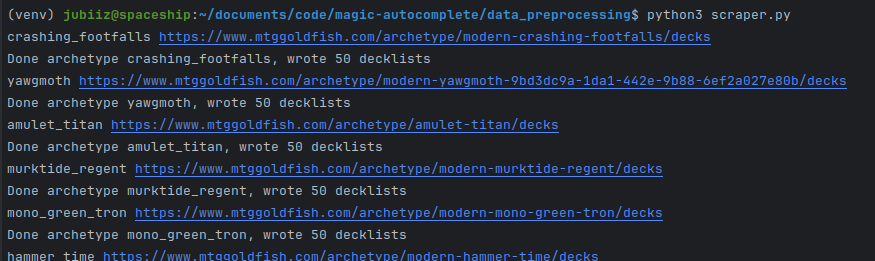

# Magic Autocomplete
## This is a Magic: the Gathering decklist autocompletion tool
### Made by Julien Audet, not affiliated in any way to Magic: the Gathering nor to Wizards of the Coast

This project was made as my CEGEP integrator project. It has been made over the course of 20 weeks and 100+ hours of
research and work. A paper detailing the development process and results of the first version is available at: 
https://docs.google.com/document/d/1LHNd_-JQrEzRyDKt-MnAX0Gg7qHPufJPXdoyU1dHDbQ/edit?usp=sharing. 

This project aims to predict Magic: the Gathering decklists from subsets of those lists, as a player would do when
facing an opponent. A demo of the working tool is available on 
https://drive.google.com/file/d/1zIPOR6mSmvFgz_L1QG9-KxZphI7PVPhe/view?usp=sharing


## Usage
The project is divided in five main parts: data acquisition (scraping), data preprocessing, model training,
model evaluation, and model usage.  

### Setup
From the project directory, create and activate a Python venv: 
```bash
# Linux 
python3 -m venv venv
source venv/bin/activate
```
```bash
# Windows
python -m venv venv
./venv/Scripts/activate
```
Then install the required dependencies:
```bash
pip install -r requirements.txt
```
You are now ready to use this project!

### Data Acquisition
To minimize drift, up-to-date data should be scraped. For a simple demo of the autocompletion tool, you can skip ahead
to the 'model usage' section. Raw data takes the form of text decklist like those available on MTGGoldfish.


The scraper code is found in `data_preprocessing/scraper.py`. First, ensure that each of the links to the different
archetypes are up-to-date. You may add archetypes to the dictionary if you want. Update the paths found in
`data_preprocessing/config.py` to match your environment. You can now start the scraper by running the
`data_preprocessing/scraper.py` file. The code gathers one list per second to avoid overloading the website, so
scraping 1000+ lists may take a while. 

Here is an example of the scraper in action: 

### Data Formatting
Before encoding the data and training models, we need to format the data. A specific description of what this entails
can be found in
[the project paper](https://docs.google.com/document/d/1LHNd_-JQrEzRyDKt-MnAX0Gg7qHPufJPXdoyU1dHDbQ/edit?usp=sharing).
To run data formatting, simply run the `data_preprocessing/formatter.py` file. 

Examples of unformatted and formatted lists can be found in `data_18_12_2023/`.

### Data Encoding
Some of the LSTM models take a card vector as input. This vector is found using the Word2Vec algorithm, which associates
similar vectors to tokens found in similar contexts. More information about this method is given in 
[the project paper](https://docs.google.com/document/d/1LHNd_-JQrEzRyDKt-MnAX0Gg7qHPufJPXdoyU1dHDbQ/edit?usp=sharing).

To encode the cards into vectors, change the output Word2Vec model's name in `data_preprocessing/vectorizer.py`,
and then run the file.  

#### Card Vector Demo
A short Jupyter notebook demonstrates the vector's capability to encapsulate similarities between cards, as it does
with words. Find this notebook in `demo/card_vector_demo.ipynb`. To use the demo, simply follow the instructions 
provided in the notebook. A video showcasing this notebook is available on
https://drive.google.com/file/d/15rqoWeKmwyorjKtAdXo68dlZ5Bj_9X4E/view?usp=sharing


### Model Training and Evaluation
The code for the original report, finished in May 2022, is available in `original_project_files_2022.zip`.
Unfortunately, upon refactoring the project in January 2024, the improved model code made during the summer of 2022 had
issues with the TensorFlow library, most likely due to the newer version used. Due to a lack of time on my end, I did
not fix these issues, and so an up-to-date model training and evaluation script is not currently available. The most
recent code for training, evaluating, and using the improved model is available in commit
`cb1699945fcba7d764c4acbda2a354bdf0b48567` with tag 'old_and_final_model_code', in directory `final_model/`. 

Old models from the report are currently available in the `models/lstm_2022/` directory. The meaning behind the names 
are explained in 
[the project paper](https://docs.google.com/document/d/1LHNd_-JQrEzRyDKt-MnAX0Gg7qHPufJPXdoyU1dHDbQ/edit?usp=sharing).
For demo purposes, I recommend using `L1000S.h5`, as it gives good results. Be aware that these models were trained with
decklists from January 2022, and so they might fail if new cards from recent competitive lists are used. For demo 
purposes, all the scraped lists from January 2022 are included in `data_21_01_2022`. 

### Model Usage
The code in `demo/report_model_demo` allows to complete decklists using the models trained for
[the project paper](https://docs.google.com/document/d/1LHNd_-JQrEzRyDKt-MnAX0Gg7qHPufJPXdoyU1dHDbQ/edit?usp=sharing). 
To obtain predictions along with an accuracy measure, update the list in `demo/report_model_demo/target_decklist.txt`
with a formatted decklist of your choice. Then, include a subset of this list in 
`demo/report_model_demo/decklist_subset.txt`. I recommend you include 4-10 cards in the subset, as it showcases the
model's ability to capture the essence of a specific strategy. Update the paths found at the top of the 
`demo/report_model_demo/report_model_demo.py` file. You can now run the file to obtain predictions. 

A video showcasing the predictions can be found on
https://drive.google.com/file/d/1zIPOR6mSmvFgz_L1QG9-KxZphI7PVPhe/view?usp=sharing
, as mentioned above.


### If you like the project or find something that could be made better, please let me know! I'd love to hear what you think!
